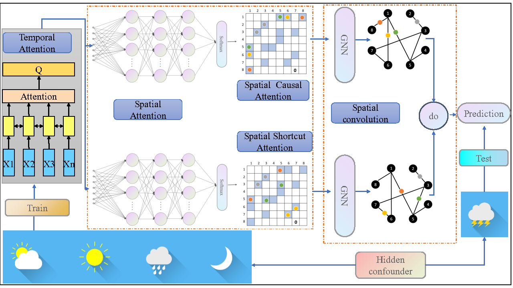

# CISTGNN

Spatio-Temporal Graph Neural Network with
Hidden Confounders for Causal Forecast




# Configuration

Step 1: The loss function and metrics can be set in the configuration file in ./configurations

Step 2: The last three lines of the configuration file are as follows:

  ```c++
  loss_function = masked_mae
  metric_method = mask
  missing_value = 0.0
  ```

loss_function can choose 'masked_mae',  'masked_mse',  'mae',  'mse'. The loss function with a mask does not consider  missing values.

metric_method can choose 'mask', 'unmask'. The metric with a mask does not evaluate missing values.

The missing_value is the missing identification, whose default value is 0.0

# Datasets

Step 1: Download PEMS04 and PEMS08 datasets provided by [ASTGNN](https://github.com/guoshnBJTU/ASTGNN/tree/main/data). 

Step 2: Process dataset

- on PEMS03 dataset

  ```shell
  python prepareData.py --config configurations/PEMS03_cistgnn.conf
  ```

- on PEMS04 dataset

  ```shell
  python prepareData.py --config configurations/PEMS04_cistgnn.conf
  ```

- on PEMS07 dataset

  ```shell
  python prepareData.py --config configurations/PEMS07_cistgnn.conf
  ```

- on PEMS08 dataset

  ```shell
  python prepareData.py --config configurations/PEMS08_cistgnn.conf
  ```

# Train and Test

- on PEMS03 dataset


```python
nohup python -u train_CISTGNN.py --config configurations/PEMS03_cistgnn.conf  > "pems03_$(date +%Y%m%d%H%M%S).out"  &
```
- on PEMS04 dataset

```python
nohup python -u train_CISTGNN.py --config configurations/PEMS04_cistgnn.conf   > "pems04_$(date +%Y%m%d%H%M%S).out"  &
```

- on PEMS07 dataset

```python
nohup python -u train_CISTGNN.py --config configurations/PEMS07_cistgnn.conf   > "pems07_$(date +%Y%m%d%H%M%S).out"  &
```

- on PEMS08 dataset

```python
nohup python -u train_CISTGNN.py --config configurations/PEMS08_cistgnn.conf  > "pems08_$(date +%Y%m%d%H%M%S).out"  &
```

  


